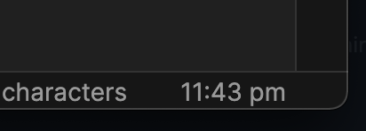

# Grandfather
A rather simple plugin that displays the time (and date, if you desire) on your status bar. I just made this to dabble with the Obsidian API as I migrate my notes to it.

You can select from a list of predefined time formats, or use a custom format that you can define youself, which you can find information about [here](https://momentjs.com/docs/#/displaying/format/).

## Installation
### From Obsidian
- _coming soon™_

### From GitHub Releases
- Go to the latest release [here](https://github.com/noatpad/obsidian-grandfather/releases/latest), & download the `grandfather.zip` file
- Extract the zip's contents to your vault's plugin folder: `<vault>/.obsidian/plugins`
- Reload Obsidian & enable the plugin in Settings -> Community Plugins

### From GitHub repo
- Clone the repo
- Run `npm i && npm run build` to build the plugin file locally
- Copy `manifest.json` and `dist/main.js` to a new folder in your vault's plugin folder: `<vault>/.obsidian/plugins`
- Reload Obsidian & enable the plugin in Settings -> Community Plugins

## Development
You can also continue to develop and customize the plugin to your liking _(it's still a simple clock though, so I'd be surprised honestly)_:
- Clone the repo
- Run `npm i` to install dependencies
- Run `npm run dev` to run a watch script that'll automatically move changes to your plugins folder
  - Remember to change `TEST_VAULT` in `rollup.config.dev.js` to the vault you'll be testing the plugin on
- Reload Obsidian if necessary
